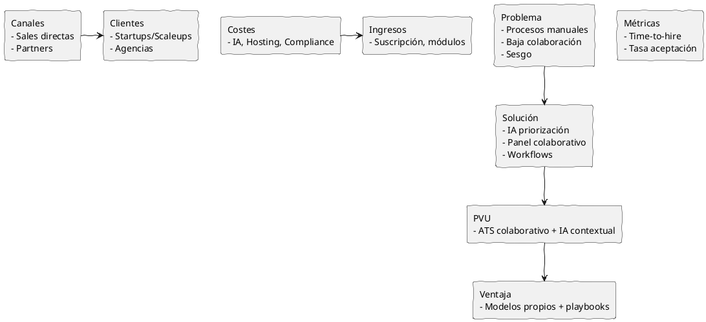
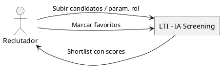
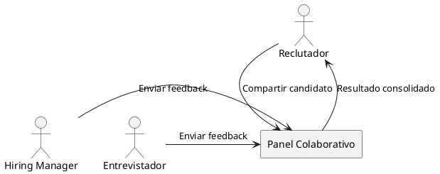
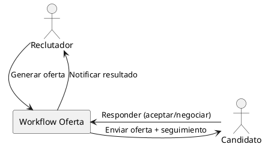

# LTI-GEZT

## 1. Descripción
LTI es un ATS moderno diseñado para reducir el trabajo manual de los equipos de RRHH, acelerar la toma de decisiones y mejorar la colaboración entre reclutadores y hiring managers mediante automatizaciones inteligentes y apoyo de IA. Su propuesta de valor única (PVU) es combinar un flujo colaborativo en tiempo real con motores de IA que priorizan candidatos según criterios dinámicos de ajuste cultural y técnico, y plantillas de comunicación que autopersonalizan mensajes.

Ventajas competitivas frente a Workday/Lever/Greenhouse:
- IA contextualizada que prioriza candidatos por probabilidad de éxito en el rol y encaje cultural, no solo por coincidencia de keywords.
- Panel colaborativo en tiempo real con comentarios estructurados y tareas asignables (reduce reuniones y emails).
- Automatizaciones end‑to‑end (sourcing → screening → scheduling → oferta) con trazabilidad y auditoría.

## 2. Funciones Principales
1. Dashboard colaborativo de contratación: Vista central con candidatos, estado del proceso y comentarios en tiempo real. (Pilares: colaboración, eficiencia)
2. Screening asistido por IA: Scoring que combina CV, entrevista y datos históricos para ordenar shortlists. (Pilares: automatización, eficiencia)
3. Workflows y automatizaciones: Plantillas y pipelines configurables que ejecutan acciones (emails, entrevistas, tareas). (Pilares: automatización)
4. Panel de feedback estructurado: Formularios rápidos para hiring managers con scoring y etiquetas reutilizables. (Pilares: colaboración)
5. Integración de calendario y entrevistas automatizadas: Sincronización y confirmaciones automáticas. (Pilares: eficiencia)
6. Auditoría y cumplimiento: Registro inmutable de decisiones y comunicación para cumplimiento legal. (Pilares: eficiencia)
7. Biblioteca de templates y playbooks de sourcing: Mejores prácticas reutilizables y A/B testing de mensajes. (Pilares: automatización)

## 3. Lean Canvas
Problema:
- Procesos manuales, baja colaboración y sesgo en screening.

Solución:
- IA para priorización, panel colaborativo y workflows automáticos.

Métricas Clave:
- Time-to-hire, tasa de aceptación de ofertas, % decisiones en panel sin reunión.

PVU:
- ATS colaborativo con IA contextual que reduce time-to-hire y mejora calidad del hire.

Ventaja injusta:
- Modelos entrenados con señales de éxito de empresas cliente + playbooks validados.

Canales:
- Ventas directas, partnerships con consultoras de RRHH, marketplace de integraciones.

Segmentos de clientes:
- Tech startups y scaleups, equipos de contratación distribuidos, agencias de recruiting.

Estructura de costes:
- Desarrollo IA, hosting, compliance, ventas.

Flujos de ingresos:
- Suscripción SaaS (por seat+por pipeline), módulos premium IA.

## 4. Casos de Uso

### Caso de Uso 1: Screening asistido por IA
Actores: Reclutador, Sistema LTI (IA)  
Objetivo: Priorizar y presentar una short‑list de candidatos para revisión rápida.  
Flujo principal:
1. Reclutador sube/etiqueta candidatos o conecta feed de sourcing.  
2. Sistema analiza CV, historial y parámetros del rol.  
3. IA asigna score y tags (técnico, cultural, riesgo).  
4. Reclutador revisa short‑list ordenada y marca favoritos.  
5. Se generan tareas para entrevistas con hiring managers.

### Caso de Uso 2: Panel colaborativo de evaluación
Actores: Reclutador, Hiring Manager, Entrevistador  
Objetivo: Capturar feedback estructurado y decidir sin reuniones largas.  
Flujo principal:
1. Reclutador comparte tarjeta del candidato con panel.  
2. Managers reciben notificación y rellenan formulario short‑feedback.  
3. Sistema consolida scores, detecta discrepancias y sugiere reunión si necesario.  
4. Decision: avanzar, descartar o pedir entrevista adicional.

### Caso de Uso 3: Automatización de oferta y cierre
Actores: Reclutador, Candidato, Sistema LTI  
Objetivo: Automatizar envío de oferta y seguimiento para mejorar tasa de aceptación.  
Flujo principal:
1. Reclutador genera oferta usando plantilla y reglas (salary bands).  
2. Sistema envía oferta al candidato y agenda follow‑ups automáticos.  
3. Candidato responde; si acepta, el sistema crea la entrada para onboarding y notifica RRHH.  
4. Si hay contraoferta, se registra el flujo y se sugiere next steps.

## Prompts usados
1. Prompt principal (Product Manager Senior): contenido usado desde `prompts.md` para generar este documento.